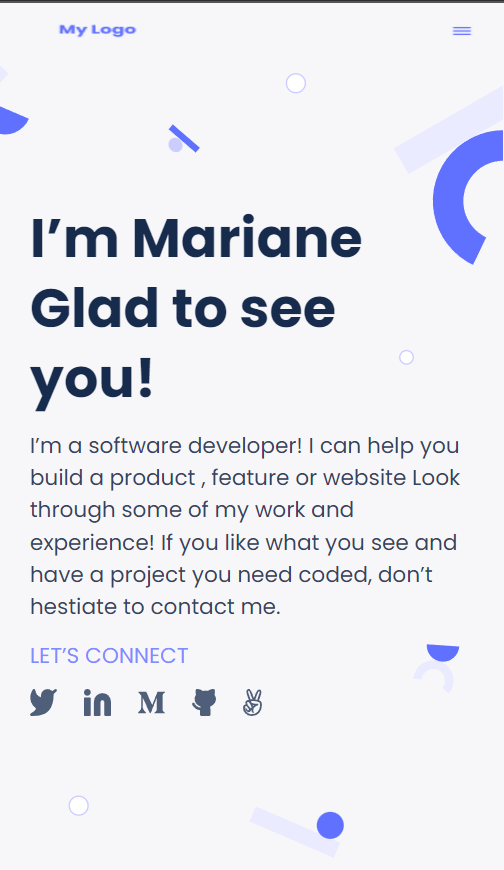

# Setup and mobile version skeleton

> The first milestone in the process of creating my portfolio.

This is my first approach to mobile web design. For this project I have created 3 sections of a website totally responsive for mobile devices using flexbox.

## Built With

- html, css

## Live Demo

[Live Demo Link](https://ferminmu26.github.io/Project-1/)

## Author

👤 **Miguel Fermín**

- GitHub: [@ferminmu26](https://github.com/ferminmu26)
- Twitter: [@ferminmu26](https://twitter.com/ferminmu26)
- LinkedIn: [LinkedIn](https://linkedin.com/in/mejfa)

## 🤝 Contributing

Contributions, issues, and feature requests are welcome!

Feel free to check the [issues page](../../issues/).

## Show your support

Give a ⭐️ if you like this project!

## 📝 License

This project is [MIT](./MIT.md) licensed.
