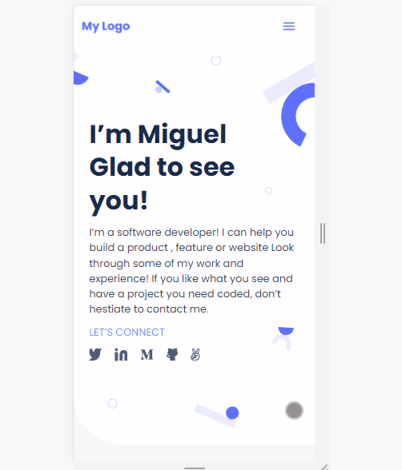

# Mobile Version Website

> The first milestone in the process of creating my portfolio.

This is my first website designed for mobile devices. For this project, I have created 5 sections of a website totally responsive using grid and flexbox and added a contact form in the footer for UX experienc

## Built With

- html, css

## Live Demo

[Live Demo Link](https://ferminmu26.github.io/Project-1/)

## Authors

👤 **Miguel Fermín**

- GitHub: [@ferminmu26](https://github.com/ferminmu26)
- Twitter: [@ferminmu26](https://twitter.com/ferminmu26)
- LinkedIn: [LinkedIn](https://linkedin.com/in/mejfa)

👤 **Kenny Salazar**

- GitHub: [@helio3197](https://github.com/helio3197)
- Twitter: [@kennysalazar31](https://twitter.com/kennysalazar31)
- LinkedIn: [LinkedIn](https://linkedin.com/in/kenny-salazar-1a1687110)

## 🤝 Contributing

Contributions, issues, and feature requests are welcome!

Feel free to check the [issues page](../../issues/).

## Show your support

Give a ⭐️ if you like this project!

## 📝 License

This project is [MIT](./MIT.md) licensed.
